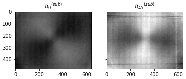
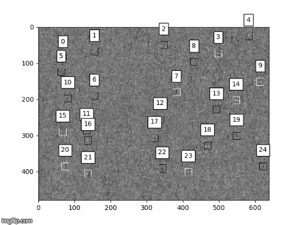

# tl;dr

Silicon photovoltaic wafers are cut from silicon inguts using a wire saw.  The wire sawing process introduces saw damage in the form of residual stress and microcracks near the wafer surfaces.  Imaging a wafer using an infrared grey-field polariscope (IR-GFP) reveals the location of microcracks since the profile of a microcrack's locally elevated shear stress field looks like a bowtie.  

This repository post processes raw IR-GFP image data [1-4], assists in creating two machine learning (ML) training sets for identifying bowties [5-8], optimizes 8 ML classifiers [9], combines classifier output though weighted soft voting [10], and demonstrates the best model's ability to classify bowties [11].  

Using xgboost.XGBClassifier() a **recall value of 96%** with a **precision of 87%** was achieved resulting in an F1 score of 0.913.  This performed better than the soft classifier when uniformly weighted and when weighted according to each classifiers peak F1 score.  Only by heavily weighting the soft voter were similar results to the XGB classifier produced.  

# bowtie-defect-identification
Bowtie defects (shown below) can be observed in microscopic shear stress images of silicon wafers.  
They are the result of residual stress acting on microcracks.  

This repository will address:
* **[1-4]** Post processing raw IR-GFP image data
    * converting .dt1 (Delta Vision) files into Shear 0, Shear 45, and Shear Max images
	* creating/applying subtraction images
	* detecting (and removing) hypersensitive pixels and unnecessary images
	* identifying (and ignoring) low quality images
* **[5-8]** Creating two machine learning (ML) training sets for identifying bowties
    * img: standard deviation and numpy arrays of shear 0 and shear 45 images
    * circlescan: standard deviation and circle sweep of shear 0 and shear 45 images
	    * circle sweep: (a.k.a. circle scan) a list of points where each point is the average value of a 20 micron radial line scan from the center of a bowtie, where the line scan is swept tangentially about the center of the bowtie
* **[9]** Optimizing 8 ML classifiers
    * Extra Trees Classifier (using img and circlescan training sets)
	* Random Forest Classifier (using img and circlescan training sets)
	* Support Vector Classifier (using img and circle scan training sets)
	* Extreme Gradient Boosted Classifier (using img training set)
	* Extreme Gradient Boosted Random Forest Classifier (using img training set)
* **[10]** Combining classifier output though weighted soft voting
    * Uniformly weighted and weighted according to each classifiers peak F1 score
* **[11]** Demonstrating the best model's ability to classify bowties
    * XGB Classifier outperformed 

For information:
* regarding the use of bowtie defects to characterize monocrystalline silicon wafers according to strength see [here](/documents/NDPE%20CHAR%20OF%20cSi%20PV%20WAFERS.pdf).
* about the methods used to collect and post process microscopic wafer images see [here](/documents/Overview_IR-GFP_Wafer_Image_Data_Set.pdf)
* about the automated process of collecting microscopic shear stress measurements see [here](/documents/IR-GFP-automation.pdf).
* about the equipment used (IR-GFP) to image wafers see Horn et al. "Infrared grey-field polariscope: A tool for rapid stress analysis
in microelectronic materials and devices" Review of Scientific Instruments 2005 and J. Lesniak & M. Zickel, "Applications of Automated Grey-Field Polariscope" SEM June 1998.

# Acknowledgments

Special thanks to Prof. Harley Johnson, Dr. Gavin Horn, Dr. Tung-wei Lin and Alex Kaczkowski whose guidance and advice have been deeply appreciated.  This study was supported by the National Science Foundation (NSF) under Grant No. CMMI13-00466.

# Instructions
The .py files provided in this repository are intended to be run sequentially according to the number in the file name; points 01 - 11 below correspond to .py files beginning with 01 - 11.  The .dt1 files containing 3,234-3,500 microscopic IR-GFP images for each wafer are not included in the repository.  You can access them through the lab external hard drive or copy them into the Wafer Data Files folder in this repository.  If you choose to do the latter then update the variables datafile and dt1file in the code to reflect the new location of the .dt1 files.  

1. Collects light level information from each microscopic image and tracks which pixels have uncommonly high intensity.  This information is saved in the designated savefile and will be used to filter out low quality images and identify hypersensitive pixels.  
    1. Set post-saw-damage-removal boolean.
        * True if wafer name starts with 00 or 02 and False otherwise
    1. Update savefile and datafile if necessary
    1. If running multiple wafers at once, uncomment multi-wafer analysis section and comment out waferlist
1. Records statistics for each IR-transmission (Light) image and for the group of Light images that make up each wafer.  These values will be used to filter out low quality microscopic IR-GFP images based on average light level and standard deviation of pixel intensities.  More details are included in the script header.
    1. Update datafile and savefile
1. During long imaging sessions, the detector heats up.  When the detector is hot it often has hypersensitive (hot) pixels.  These are pixels which register higher than true shear max values.  This script identifies and records the location of hypersensitive pixels.  More details are included within the script.  
    1. Update file locations
    1. Set psdr boolean
    1. Update waferlist to reflect which wafer(s) you want to check for hot pixels
    
	We define a hypersensitive pixel as one that occurs as the most intense pixel (in a shear max image) 4 or more times out of the 3,234 shear max images that make up a wafer.  Each image contains 640 * 480 pixels, as such the probability of a single pixel that has already occured as the most intense pixel in one image reoccuring as the most intense pixel in 0 to 4 other images is given by the following graph. 

    

1. Generates a shear 0 and shear 45 subtraction image for each wafer.  A subtraction image is the average of 108 images and will be used to remove the effects of consistent optical aberrations caused by reflections, imperfections in the optic train, and a polychromatic light source.  Low quality images (images of the wafer mask or blurry images) are filtered out prior to selecting the 108 images that will be used to make the subtraction image.  Of the remaining images, the 108 images with the lowest average shear max retardation are selected to make the subtraction image.  A brief explanation for why this is done is included in the script.   

    In the figure below notice the removal of the large faint bowtie pattern in the background while smaller bowties - caused by locally elevated shear stress near cracks - remain unaffected by the subtraction image.  The horizontal and vertical lines are caused by detector imperfections while the large faint bowtie pattern is caused by optical aberrations and a slightly elliptic (almost circularly polarized) polarized light source.  
    
<b>Example Subtraction Image</b>

    

    
<b>Effect of Applying Subtraction Image</b>

    

1. Generates annotated images of 5x IR-GFP images to facilitate the process of manually identifying bowties.  Manually identified bowties and nonbowties will be used to train the machine learning classifier.  The procedure of doing so is as follows:
    1. Each image is generated from a .dt1 file
    1. Low quality images (blurry or low light) are filtered out
    1. Images are post processed by applying a subtraction image and removing hypersensitive pixels
    1. Shear max images are sub-divided into 16 equally sized "sub-images"
    1. The most intense pixel in the shear max sub-image region is boxed and annotated by the sub-image index
    1. Image is saved for manual bowtie identification (images are saved in an external directory due to memory constraints)
    
<b>Shear 0 Manual Bowtie Identification</b>

    

    
<b>Shear 45 Manual Bowtie Identification</b>

    

    In the example above the highest intensity pixel in 16 sub-image regions is boxed.  The box does not indicate whether it is a bowtie or not.  There is a large bowtie at location 3 and smaller bowties at locations 7 and 12. For your convenience set of 500 manually identified bowties and non-bowties are already provided here (<a href='https://github.com/LPRowe/bowtie-defect-identification/tree/master/Wafer_Images/manually_identified_bowties'>bowties</a> & <a href='https://github.com/LPRowe/bowtie-defect-identification/tree/master/Wafer_Images/manually_identified_non-bowties'>non-bowties</a>).  Example bowtie and non-bowties are 40 by 40 pixel .npy files that are named according to: {wafer}-{image index}-{sub-image index}-{pixel index}-{shear 0/45}.npy
    
    If you wish to expand upon the given identified bowties and non-bowties do the following:
    1. Run script 5 for the desired wafer(s)
    1. Look through the images generated by script 5 for bowties and non-bowties.  Keep in mind the boxes only show the maximum shear max pixel intensity in that sub-image region which is not necessarily a bowtie.  A machine learning algorithm will be trained based on the bowties and non-bowties that are manually identified from these images.  
    1. In the folder /Wafer_Images create two new .txt files named {wafer}_imgloc_subloc manual ID bowties.txt and {wafer}_imgloc_subloc manual ID other.txt
    1. Note the location of each bowtie and non-bowtie in the respective files by {image location},{sub-image location} (see the example Wafer_Images\50_imgloc_subloc manual ID bowties.txt file for clarification)
    
1. This script will read the manually identified bowtie and non-bowtie location files that you created after running script 5.  It will then load the images containing bowties, post process the image with a subtraction image, and crop a 40 by 40 pixel region around each bowtie or non-bowtie.  The cropped (non)bowties are saved as .npy files for ease of access later without the need for post processing.  More information/directions regarding the scipt are included in the scripts header.  

1. Loads the .npy files for each (non)bowtie and extracts the features of interest and class into a numpy array.  Initially the goal was to make several diverse classifiers that make different mistakes when classifying bowties and would thus benifit greatly through an ensemble method.  As such, two datasets were made using the same manually identified (non)bowties:
	* **bowtie_data** shape(-1, 154) focuses on features related to the profile of the bowtie as observed from the circle sweep such as:
		* Non-features: Wafer, Image Location, Sublocation (on image), Pixel on Image
		* &theta;M angle (measured form x+ axis) of maximum intensity in the circle sweep for the shear max image
		* &theta;0 and &theta;45 similar for shear 0 and shear 45 images
		* Standard deviation of pixel valus in shear 0 and shear 45 images
		* 72 values from the circle sweep around the shear 0 bowtie
		* 72 values from the circle sweep around the shear 45 bowtie
		* Bowtie classification 1 for bowtie 0 for nonbowtie
	* **image_data** shape(-1, 135) focuses on the 8 by 8 pixel array surrounding the bowtie
		* Non-features: Wafer, Image Location, Sublocation (on image), Pixel on Image
		* Standard deviation of pixel valus in shear 0 and shear 45 images
		* 8x8 numpy array of pixel values centered on the bowtie in shear 0 image converted to 1D array 
		* 8x8 numpy array of pixel values centered on the bowtie in shear 45 image converted to 1D array 
		* Bowtie classification 1 for bowtie 0 for nonbowtie

    Note: Any bowtie that is within 10 pixels of the edge of the image is removed by this script because the non-uniform numpy array size would raise an error when training the ML classifiers.  

1. Strips away features like wafer, image location, sub-image location and pixel location that will not assist in classifying each (non)bowtie.  Then balances the training sets so that there are an equal number of bowties and nonbowties.  More details are included in the script header.  

1. Eight classifiers were individually optimized to classify whether or not a bowtie is present in an image.  I remained fairly consistent with how the code is structured for each classifier so I will speak about them generally.  

    *  bowtie_data or image_data is loaded and split into test and train data
	    * random_state=42 was used across all classifiers for uniformity
		* test data (20%) and training data (80%) are both balanced with respect to (non)bowties
		* in the case of XGBC_img and XGB-RFC_img data was split into test data (20%), validation data (16%) and training data (64%) for optimizing parameters and used the 80:20 split for final training
		* transformers for SVMs use a standard scaler to prevent outliers from skewing the data while random forest classifiers do not use a scaler as it is not necessary
	* seeking code block is where parameters are optimized using either grid search or random search
	    * optimal parameters are determined by evaluating the classifier via 5 fold cross validation or by an eval_set such as the validation sets used for the extreme gradient boosted classifiers
		* the best performing parameters are used to train the classifer which is then tested on the test set, the precision, recall, and F1 score are printed
		* once acceptable parameters were determined based on the CV scores the param grid was reduced to the best value for each parameter.  If you alter the input data I encourage you to only use these values as a starting point and reoptimize the classifiers
	* to avoid overfitting the following regularization hyperparameters/techniques were optimized/used
	    * XGBC: gamma, learning_rate, max_depth, reg_lambda, early stopping
		* XGBRFC: learning_rate, max_depth, min_child_weight, subsample, colsample_bynode, reg_lambda
		* SVC: kernel, gamma, C, number of features, size of max pool
		* RFC: max_depth, bootstrap, min_samples_leaf, max_features
		* ETC: max_depth, bootstrap, min_samples_leaf, max_features
	* final_params_selected code block is where the final version of the classifier is trained (still leaving the test set out for ensemble purposes) and exported as a .pkl file
	* export_full_transformed_dataset codeblock exports the test data in its transformed state
	    * this saves the hastle of fitting and transforming the test sets to match each classifier's needs when testing the soft voting classifier
		
    A few classifiers have custom made transformers, such as reduce_features_in_sweep, combine_theta_peaks, and max_pooling.  The latter two assume the input file is a pandas dataframe.  As such, these transformers should be placed at the beginning of the transformation pipeline since other transformers (like imputers) output numpy arrays.

1. Each classifier is capable of predicting the probability of each instance being a bowtie or nonbowtie.  A soft voting classifier takes into account the predicted probabilities from all of the classifiers when calculating the probability that an instance is a bowtie.  Each classifier can be given equal weight ('uniform') or weighted according to how well the classifier performed on its own ('f1' or 'f1pow').  These are explained in more detail in the script comments.  

	* The performance of the classifiers has been calculated individually and using the soft voting method in script [10] and in /side-scripts/PR_scores_for_classifiers.py
	* With regard to the soft voter's performance: 'f1pow'>'f1'>'uniform'
	* As evident below, the xgboost.XGBClassifier() outperformed even the soft voting classifier
	* As the power of 'f1pow' is increased the soft voter's F1 curve will gradually approach XGB_img classifier's F1 curve ('f1pow' soft voting curve where power=20 is included in images/f1pow_score_all_classifiers.png)

    

	
	Where ET=extra trees, RF=random forest, SVM=support vector machine, XGB=extreme gradient boosted, img refers to the img data set used to train the classifier and circlesweep refers to the circlesweep data set used to train the classifier.

1. This script serves as an example of how our best bowtie classifier can be used to identify bowties on new images outside of the training and test set.  The images are loaded as dt1 files, converted to shear 0, shear 45, and IR-transmission numpy arrays, and post processed (subtraction image applied, hypersensitive pixels reset, low quality image removal).  Each image is split into subimages and the peak pixel of each subimage is checked to see if it contains a bowtie.  

    

    
    

    Positive classifications are boxed in white while negative classifications are boxed in black.  Finally the image is annotated according the subimage index associated with each bowtie and saved.  Example images (like the one below) can be found in bowtie-defect-identification\Wafer_Images\17_example_clf_bowties.  

    A keen eye will notice bowties at (550,200) and (50,280) that were not identified.  This is because of the method used to select pixels that potentially belong to bowties.  Only the array around the most intense pixel (in the shear max image) of each subimage is classified.  This is because bowties are caused by microcracks where shear stress is locally elevated, as such it is likely for the highest shear max pixel to be located at the center of a bowtie.   
	
	So why 16 divisions? The GIF above is divided into 16 subimages for example only, so as not to clutter the image with annotations.  The example below shows that by simply increasing the divisions from 16 to 25 the two overlooked bowties have now been classified as well. 
	
	

    
    

	
	So why not check every pixel? We must also consider the time required to extract features and classify each bowtie.  Feature extraction and classification together require on average 1019 +/- 60 &mu;s.  Thus to classify every location in a wafer image (640x480 pixels) would require over 300 seconds per image.  However, by dividing the image into subimages and classifying only the most intense pixels, feature extraction and classification require only 1 ms per subimage (approximately 20,000 times faster when only considering 16 subimages).  
	